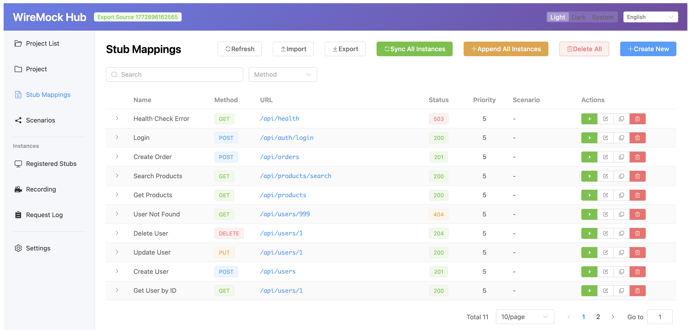

# WireMock Hub

[](https://github.com/ykagano/wiremock-hub/releases)
[](https://github.com/ykagano/wiremock-hub/actions/workflows/ci.yml)
[](https://hub.docker.com/r/yukagano/wiremock-hub)

Extends [WireMock](https://wiremock.org/) with a graphical user interface for centralized management of distributed WireMock environments.



## Why WireMock Hub?

- **No more hand-editing JSON** — Create and manage WireMock stubs through a visual editor instead of writing `mappings.json` by hand
- **Switch stubs per project** — Organize stubs into projects and swap them on a single WireMock instance to match the test scenario you need
- **Instant sync to all instances** — Push stub changes to every WireMock instance at once, so all environments stay in sync without redeploying or sharing files

## Features

### Stub Management & Sync

- **Visual stub editor**: Create and edit WireMock mappings with a form-based UI (method, URL matching, headers, query params, body patterns, response, delay, priority)
- **Bulk sync**: Deploy all stubs to multiple WireMock instances with a single click (Sync resets first; Append preserves existing mappings)
- **Import / Export**: Import stubs from JSON files or export for sharing
- **Duplicate**: Clone existing stubs or entire projects

### Scenario Management

- **Visual scenario editor**: Build stateful stub chains with drag-and-drop step reordering
- **Inline state editing**: Edit state names with automatic propagation to adjacent steps
- **Flow validation**: Visual warnings for missing "Started" state, unreachable states, and duplicates
- **Scenario reset**: Reset all scenarios on an instance back to "Started" state

### Request Log & Recording

- **Request log viewer**: Browse all HTTP requests with tabs for matched / unmatched requests
- **Filtering**: Filter by URL pattern, HTTP method, and status code range
- **Request details**: Inspect full request/response headers, body, and timing
- **Stub generation**: Convert a logged request into a new stub
- **Recording**: Start/stop proxy recording on individual or all instances at once

### Registered Stubs View

- **Live inspection**: View stubs actually registered on each WireMock instance
- **Hub tracking**: Distinguish Hub-created stubs from externally registered ones
- **Direct management**: Delete individual or all mappings on an instance

### Instance & Project Management

- **Project-based organization**: Group stubs and instances by environment
- **Health check**: Monitor connection status of each instance in real-time
- **Stub testing**: Send test requests against stubs to verify behavior

### Data Persistence & UI

- **SQLite storage**: File-based persistence, no external database required — share or back up by copying the file
- **Multilingual UI**: Switch between English and Japanese
- **Dark / Light / System theme**: Choose your preferred appearance
- **Responsive design**: Works on desktop and mobile

## Architecture

```
┌─────────────────────────────────────────────────────────────────┐
│                        WireMock Hub                             │
│  ┌──────────────┐    ┌──────────────┐    ┌──────────────┐       │
│  │   Frontend   │ -> │   Backend    │ -> │    SQLite    │       │
│  │   (Vue 3)    │    │  (Fastify)   │    │ (Persistence)│       │
│  └──────────────┘    └──────────────┘    └──────────────┘       │
└─────────────────────────────────────────────────────────────────┘
                              │
                              │ Sync
                              ▼
         ┌────────────────────┼────────────────────┐
         │                    │                    │
         ▼                    ▼                    ▼
   ┌──────────┐         ┌──────────┐         ┌──────────┐
   │ WireMock │         │ WireMock │         │ WireMock │
   │ Instance │         │ Instance │         │ Instance │
   │    #1    │         │    #2    │         │    #3    │
   └──────────┘         └──────────┘         └──────────┘
```

## Tech Stack

| Layer    | Technology                        |
| -------- | --------------------------------- |
| Frontend | Vue 3 + TypeScript + Element Plus |
| Backend  | Node.js + Fastify + Prisma        |
| Database | SQLite                            |
| Build    | Vite + pnpm workspace             |

## Quick Start

### WireMock Hub + WireMock bundled image (Recommended)

```bash
# WireMock Hub + WireMock bundled image
docker run -d -p 3000:3000 ghcr.io/ykagano/wiremock-hub:latest
open http://localhost:3000/hub/

# WireMock instance URL (register after creating a project)
http://localhost:3000
```

> See [All-in-One README](./allinone/README.md) for detailed configuration and ECS deployment.

### WireMock Hub standalone image (connect to existing WireMock)

```bash
docker run -d -p 3000:3000 ghcr.io/ykagano/wiremock-hub-standalone:latest
open http://localhost:3000
```

Then register your existing WireMock instances via the UI.

### Docker Compose Examples

```bash
# All-in-One version (Hub + WireMock bundled)
cd allinone && docker compose up -d

# Hub only
docker compose up -d

# Hub + demo WireMock instances (for testing)
docker compose -f docker-compose.yml -f docker-compose.demo.yml up -d
```

## Local Development

### Prerequisites

- Node.js 20.19+ or 22.12+
- pnpm

### Installation

```bash
# Install dependencies
pnpm install

# Generate Prisma client and create database
pnpm run db:generate

# Run database migration
cd packages/backend && pnpm exec prisma migrate dev

# Start development server
pnpm run dev
```

### Environment Variables

```bash
# packages/backend/.env
DATABASE_URL="file:../../data/wiremock-hub.db"
```

## Usage

### 1. Create a Project

A project groups stubs and WireMock instances for a given environment (dev/staging/etc.).

### 2. Add Instances

Register each WireMock server's admin API URL. Use health check to verify connectivity.

### 3. Create Stubs

Create stub mappings via the visual editor. Stubs are saved to SQLite.
For stateful APIs, use the Scenario editor to build state chains with drag-and-drop.

### 4. Sync

- **Sync All**: Resets all instances and deploys stubs — ensures full consistency
- **Append All**: Adds stubs on top of existing mappings without resetting

### 5. Monitor

- **Requests**: View request logs, filter by URL/method/status, and import unmatched requests as new stubs
- **Registered Stubs**: Inspect what's actually registered on each instance
- **Recording**: Start proxy recording to capture live traffic as stubs

## License

Apache 2.0
