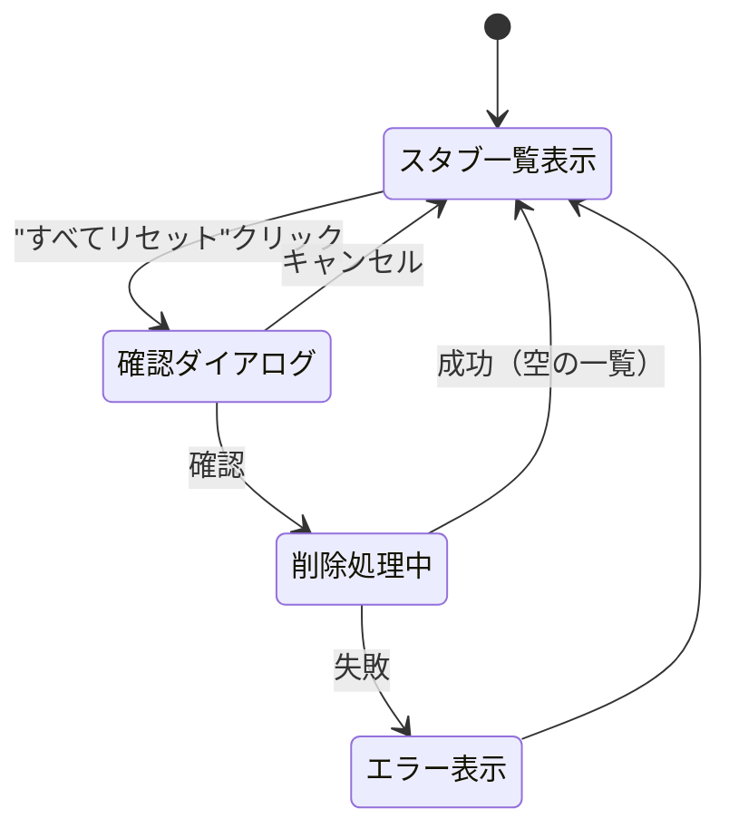
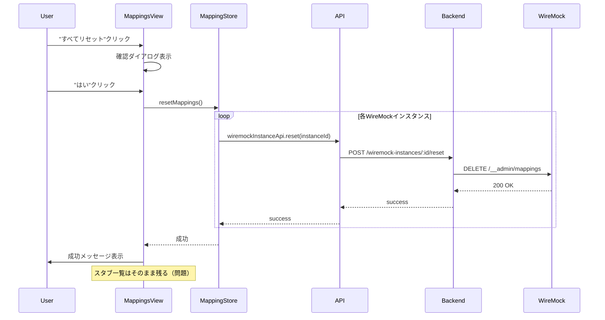
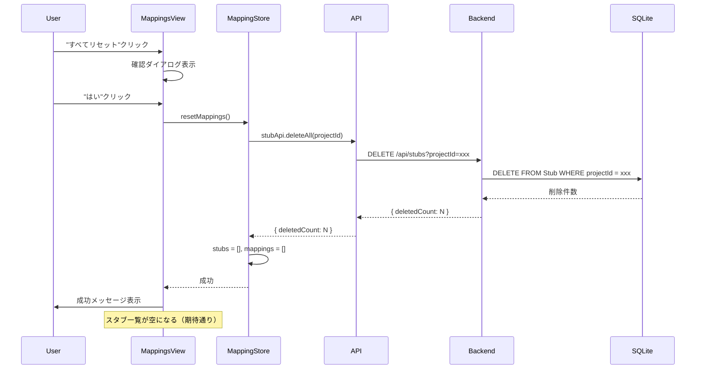

# Reset All Stub Data 機能改善

## 目的・背景

### Issue
- [#31](https://github.com/ykagano/wiremock-hub/issues/31): The "Reset All" function in Stub Mappings should delete all stub data stored in wiremock-hub

### 現状の問題
現在の「すべてリセット」機能は、WireMock側のマッピングのみを削除しており、wiremock-hub側のSQLiteに保存されているスタブデータは削除されない。これはユーザーにとって直感的ではない。

### 現状の動作詳細

| コンポーネント | ファイル | 処理内容 |
|----------------|----------|----------|
| MappingsView | `MappingsView.vue:296-315` | 確認ダイアログ表示後、`mappingStore.resetMappings()`を呼び出し |
| MappingStore | `mapping.ts:159-205` | プロジェクト内の全アクティブなWireMockインスタンスに対して`wiremockInstanceApi.reset()`を実行 |
| API Client | `api.ts:151-153` | `POST /wiremock-instances/:id/reset`を呼び出し |
| Backend | `wiremock-instances.ts:426-458` | WireMock側の`DELETE /__admin/mappings`を実行 |

**結果:**
- WireMock側のマッピング: **削除される**
- wiremock-hub側のスタブデータ（SQLite）: **削除されない**

### 期待される動作（変更後）
「すべてリセット」をクリックすると、wiremock-hubに保存されているスタブデータが削除される。WireMock側のマッピングは削除しない。

**変更後:**
- WireMock側のマッピング: **削除しない**
- wiremock-hub側のスタブデータ（SQLite）: **削除される**

### 理由
- ユーザーが「スタブマッピング」画面でリセットを行う場合、その画面で管理しているデータ（wiremock-hub側のスタブ）が削除されることを期待する
- WireMock側のマッピングを削除したい場合は、「全インスタンスに同期」機能（スタブが0件の状態で同期）で対応可能
- WireMock側の直接操作は別の機能として提供すべき

## 変更概要

### 1. バックエンド: プロジェクト内スタブ一括削除API

新しいエンドポイント `DELETE /api/stubs?projectId=xxx` を追加する。

```
DELETE /api/stubs?projectId={projectId}
```

**処理内容:**
1. projectIdの妥当性を検証
2. 該当プロジェクトの全スタブをSQLiteから削除
3. 削除件数を返却

**レスポンス:**
```json
{
  "success": true,
  "data": {
    "deletedCount": 5
  }
}
```

### 2. フロントエンドAPI

`stubApi`に新しいメソッドを追加:

```typescript
async deleteAll(projectId: string): Promise<{ deletedCount: number }>
```

### 3. フロントエンドStore

`mapping.ts`の`resetMappings()`関数を変更:

**変更前:** WireMock側のマッピングをリセット（全インスタンスに対して`wiremockInstanceApi.reset()`を実行）
**変更後:** wiremock-hub側のスタブデータを削除（`stubApi.deleteAll()`を実行）

### 4. i18n: メッセージの更新

#### 確認ダイアログ

確認ダイアログには、WireMock側のスタブも削除したい場合の案内を含める。

| キー | 現在 | 変更後 |
|------|------|--------|
| `mappings.confirmReset` (ja) | すべてのマッピングをリセットしますか？ | プロジェクト内のすべてのスタブを削除しますか？この操作は取り消せません。 |
| `mappings.confirmReset` (en) | Are you sure you want to reset all mappings? | Delete all stubs in this project? This action cannot be undone. |
| `mappings.confirmResetNote` (ja) | - (新規) | WireMock側のスタブも削除する場合は、削除後に「全インスタンスに同期」を実行してください。 |
| `mappings.confirmResetNote` (en) | - (新規) | To also delete stubs on WireMock instances, run "Sync All Instances" after deletion. |

#### 成功メッセージ

成功メッセージにも同様の案内を含める。

| キー | 現在 | 変更後 |
|------|------|--------|
| `messages.stub.resetSuccess` (ja) | すべてのマッピングをリセットしました | すべてのスタブを削除しました |
| `messages.stub.resetSuccess` (en) | All mappings have been reset | All stubs have been deleted |
| `messages.stub.resetSuccessNote` (ja) | - (新規) | WireMock側も同期するには「全インスタンスに同期」を実行してください |
| `messages.stub.resetSuccessNote` (en) | - (新規) | Run "Sync All Instances" to sync WireMock |

### 5. UI: 確認ダイアログの改善（Vue h()関数を使用）

確認ダイアログに案内メッセージを表示するため、Vue の `h()` 関数を使用してVNodeを構築する。
このアプローチは型安全で柔軟性があり、i18nメッセージにHTMLを混在させる必要がない。

**変更前:**
```typescript
ElMessageBox.confirm(
  t('mappings.confirmReset'),
  t('common.confirm'),
  {
    confirmButtonText: t('common.yes'),
    cancelButtonText: t('common.no'),
    type: 'warning'
  }
)
```

**変更後:**
```typescript
import { h } from 'vue'

ElMessageBox.confirm(
  h('div', [
    h('p', { style: 'margin: 0;' }, t('mappings.confirmReset')),
    h('p', {
      style: 'color: #909399; font-size: 12px; margin-top: 8px; margin-bottom: 0;'
    }, t('mappings.confirmResetNote'))
  ]),
  t('common.confirm'),
  {
    confirmButtonText: t('common.yes'),
    cancelButtonText: t('common.no'),
    type: 'warning'
  }
)
```

**表示イメージ:**
```
┌─────────────────────────────────────────────┐
│ 確認                                    [×] │
├─────────────────────────────────────────────┤
│ ⚠ プロジェクト内のすべてのスタブを削除    │
│   しますか？この操作は取り消せません。    │
│                                             │
│   WireMock側のスタブも削除する場合は、    │
│   削除後に「全インスタンスに同期」を      │
│   実行してください。                       │
│                                             │
│              [いいえ]  [はい]              │
└─────────────────────────────────────────────┘
```

## 影響するファイル一覧

| ファイル | 変更内容 |
|----------|----------|
| `packages/backend/src/routes/stubs.ts` | DELETE /api/stubs?projectId エンドポイント追加 |
| `packages/frontend/src/services/api.ts` | `stubApi.deleteAll()` メソッド追加 |
| `packages/frontend/src/stores/mapping.ts` | `resetMappings()` の実装変更 |
| `packages/frontend/src/views/MappingsView.vue` | 確認ダイアログに案内メッセージ追加 |
| `packages/frontend/src/i18n/locales/ja.json` | 確認メッセージ・成功メッセージ・案内メッセージの更新 |
| `packages/frontend/src/i18n/locales/en.json` | 確認メッセージ・成功メッセージ・案内メッセージの更新 |
| `e2e/tests/*.spec.ts` | 必要に応じてE2Eテスト追加 |

## 状態遷移図



## シーケンス図

### 変更前（現状）



### 変更後



## 実装Step

### Step 1: バックエンドAPI追加
- `packages/backend/src/routes/stubs.ts` に DELETE エンドポイント追加

### Step 2: フロントエンドAPI追加
- `packages/frontend/src/services/api.ts` に `deleteAll()` メソッド追加

### Step 3: i18n更新
- ja.json, en.json に新規メッセージ追加（`confirmResetNote`, `resetSuccessNote`）
- 既存メッセージの更新（`confirmReset`, `resetSuccess`）

### Step 4: Store実装変更
- `packages/frontend/src/stores/mapping.ts` の `resetMappings()` を変更
- 成功時に案内メッセージも表示

### Step 5: UI改善
- `packages/frontend/src/views/MappingsView.vue` の確認ダイアログに案内メッセージを追加

### Step 6: E2Eテスト追加
- Reset All機能のE2Eテストを追加
